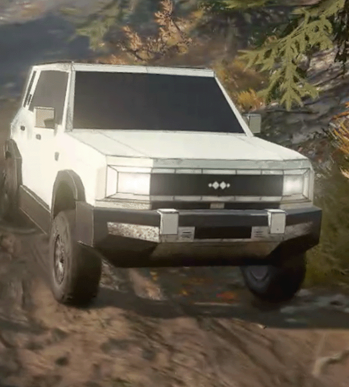

# SnowRunner方程豹5模组

# 构建说明

1. 参考官方文档：https://expeditions-guides.saber.games/truck_modding/getting_started/intro/
2. 下载安装雪地奔驰（以Steam版为例）
3. 在游戏中下载"Proving Ground"模组，用它来测试和打包自己的模组
4. 克隆此项目到`%USERPROFILE%\Documents\My Games\SnowRunner\Media\Mods`
5. 启动游戏进入Proving地图